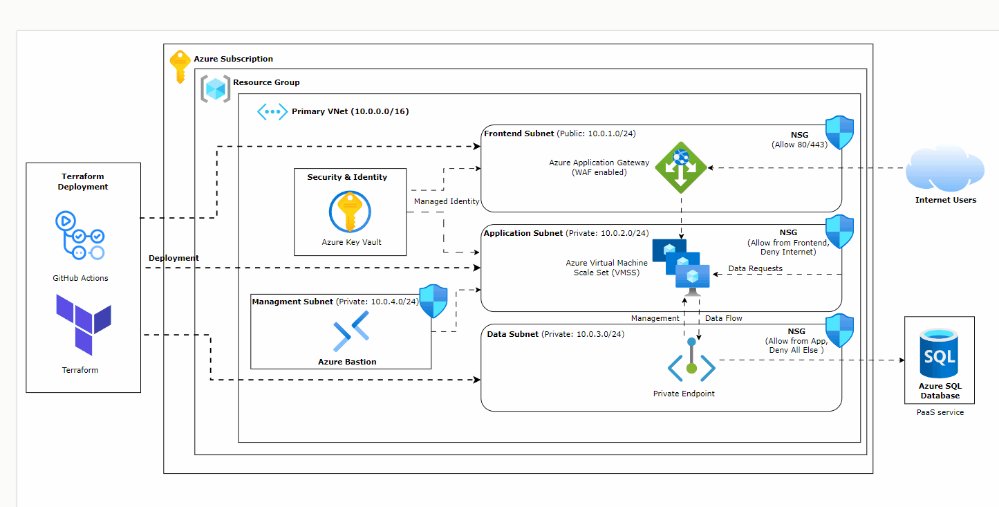

# Azure 3-Tier Infrastructure — Terraform

A production-ready, modular Terraform project that deploys a **three-tier architecture** (Frontend · App · Data) on Microsoft Azure, with a fully automated GitHub Actions CI/CD pipeline.

---

## Architecture



All subnets live inside a single VNet (`10.0.0.0/16`) and are protected by dedicated Network Security Groups with least-privilege rules.

---

## Repository Structure

```
azure-terraform-3tier/
├── modules/
│   ├── networking/          # VNet, subnets, NSGs
│   │   ├── main.tf
│   │   ├── outputs.tf
│   │   └── variables.tf
│   └── compute/             # VMSS + Internal Load Balancer
│       ├── main.tf
│       └── variables.tf
├── environments/
│   └── dev/                 # Dev environment root config
│       ├── main.tf
│       ├── providers.tf     # Remote backend + provider versions
│       ├── variables.tf
│       └── terraform.tfvars
└── .github/
    └── workflows/
        └── terraform-deploy.yml
```

---

## Prerequisites

| Tool | Minimum version |
|------|----------------|
| Terraform | 1.5.0 |
| Azure CLI | 2.50.0 |
| An Azure Service Principal | with `Contributor` role |

---

## Quick Start

### 1 — Clone the repository

```bash
git clone https://github.com/m0h4j1r/azure-terraform-3tier.git
cd azure-terraform-3tier/environments/dev
```

### 2 — Configure credentials

```bash
export ARM_CLIENT_ID="<sp-client-id>"
export ARM_CLIENT_SECRET="<sp-client-secret>"
export ARM_SUBSCRIPTION_ID="<subscription-id>"
export ARM_TENANT_ID="<tenant-id>"
export TF_VAR_ssh_public_key="$(cat ~/.ssh/id_rsa.pub)"
```

### 3 — Initialise and deploy

```bash
terraform init
terraform plan
terraform apply
```

---

## Remote State

The `providers.tf` backend block points to an Azure Storage Account. Create it once before the first `terraform init`:

```bash
az group create -n rg-tfstate -l westeurope
az storage account create -n sttfstate<suffix> -g rg-tfstate --sku Standard_LRS
az storage container create -n tfstate --account-name sttfstate<suffix>
```

Replace `<unique_suffix>` in `providers.tf` with the actual storage account name.

---

## GitHub Actions

| Trigger | Behaviour |
|---------|-----------|
| Pull Request to `main` | `fmt` → `validate` → `plan` (result posted as PR comment) |
| Push to `main` | Same checks + `apply` |

### Required GitHub Secrets

| Secret | Description |
|--------|-------------|
| `AZURE_CLIENT_ID` | Service Principal App ID |
| `AZURE_CLIENT_SECRET` | Service Principal password |
| `AZURE_SUBSCRIPTION_ID` | Target Azure Subscription |
| `AZURE_TENANT_ID` | Azure AD Tenant |
| `SSH_PUBLIC_KEY` | SSH public key for VMSS admin access |

---

## Security Notes

- **No credentials are hardcoded.** All secrets are supplied via environment variables or GitHub Actions Secrets.
- NSG rules enforce **least-privilege** traffic flow between tiers.
- Terraform state is stored remotely in Azure Blob Storage with versioning.

---

## License

MIT
